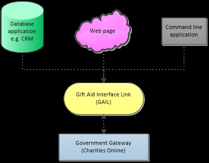
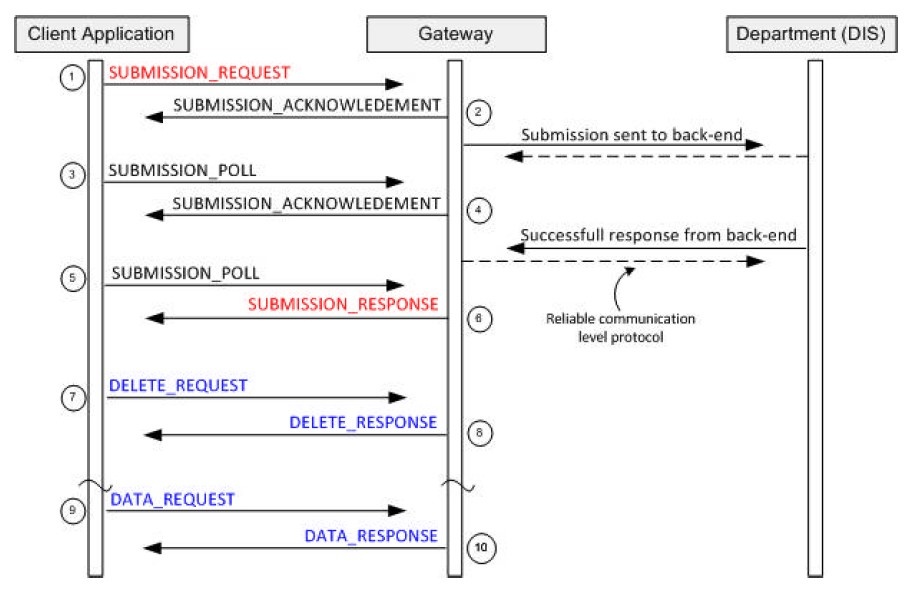

# How to Integrate GAIL

## Step 1 - Create An Application

Firstly, you need to create, or decide on, which application you want to use to refer to the GAIL library.

Here are some examples:

## Step 2 – Provide data table

Provide a standard ADO.net data table which acts as the input for GAIL. The input table has no limits to the number of rows it can have, however the tool may split the table into smaller ones if it exceeds the Charities Online limit. 

There are different required fields depending on the data that you are submitting.  The data will fall into one of these categories:

-	Donations with individual donor details – Fields required are:

|Name of Field|Description|Mandatory?|
|-----------------|--------------|----------|
|Title        |Title of donor|No        |
|Fore	|First name of donor|Yes|
|Sur	|Last name of donor|	Yes|
|House|	House name/number or first line of address|	Yes|
|Postcode	|Postcode of donor address|	Yes, for UK addresses|
|Sponsored	|Indicates if donations came from a sponsorship.  See HMRC documentation for more details.  The value can be Y or Yes.|	|
|Date|Donation date|	Yes|
|Total|Amount of the donation|Yes|

-	Donations with aggregated details:

|Name of Field|	Description|Mandatory?|
|-------------|------------|----------|
|Description|A meaningful description of the donations|Yes|
|Date|Donation date|Yes|
|Total|Amount of the donation|Yes|

**In the input table, the column names must match the names of the fields above exactly.**
You can include more columns than this if you want, but these are the required ones.

If you want to include aggregated donations in your submission, you must include a column called Type and for each row that is an aggregated donation, the value of Type must be AGG.  The rows for individual donations must have a type of GAD.  If you don’t have a type column the application will treat everything as an individual donor.

To include [Other Income](https://www.gov.uk/guidance/schedule-spreadsheet-to-reclaim-tax-on-interest-and-other-income) you must set the values in the `app.config`. The properties that start `OtherInc` correspond to the `/R68/Claim/Repayment/OtherInc` elements (see the Charities Online specification for further details: https://www.gov.uk/government/publications/charities-technical-specifications-gift-aid-repayments-rim-artefacts)

## Step 3 – Decide on action

Possible actions you can do with the tool are:

- Initiate the whole gift aid process
- Create a straightforward XML file out of your data table
- Send a data request to the Government Gateway
- Send a polling message to the Government Gateway (to check on claim progress)
- Create your own gift aid process using the individual steps that are available in the tool and required by the Government Gateway.  This is the process as provided by HMRC:

The GAIL tool provides the core of the ‘Client Application’ step (although it doesn’t provide the whole of the ‘client application’ – it needs to be called by some other harnessing code).

## Step 4 – Log file

The logging is implemented using [log4net](https://logging.apache.org/log4net/) so all the configuration that is available there is available to you. The default logging level is set to INFO. You can change this according to your development and deployment needs.

You need to initialize log4net in the calling application. An easy way is by declaring the attribute [assembly: log4net.Config.XmlConfigurator(Watch = true)] for the calling class, or alternatively create some other log4net set up method.

Once that is done, a verbose narrative of events is written to a log file, so you need to decide what to do with the logs.  You could:

- Leave them as straightforward text files (e.g. on disk)
- Put them in a database table
- Display on a web page

## Step 5 – Configuration

You will need to configure the tool so that it:
a)	Does what you require technically
b)	Contains information about the charity you are submitting Gift Aid claims on behalf of (e.g. the charity’s name and charity number) 
GAIL also requires access to a writable location (e.g. `C:\temp` on a local machine).

|Key Field|Value Field|Explanation|Possible Values|
|---------|-----------|-----------|---------------|
|key="env"|value="local"|Environment.  It could be your local system, the development Government Gateway or the live Government Gateway.|Local Test Live|
|key="PasswordMethod"|value="clear"|When you store a password in a file you can store it so it’s visible or you can hash it so it’s obscured.  MD5 hashes the password.|Clear MD5|
|key="BatchSize"|value="2500"|Maximum number of donation records in a file.  Larger files will be split automatically by the tool.|Any whole number|
|key="ReasonableWaitInMinutes"|value="10"|Length of time that GAIL will poll the Government Gateway for before it gives up.|Any whole number|
|key="RestartAfterInMinutes"|value="60"|If there is no response within the ReasonableWaitInMinutes, this is how long it will be until it starts trying again.|Any whole number|
|key=”SubmissionRequestFilePrefix”|value=”LocalRequestMessage”|Choosing the start of the file name for your submission file.|Text|
|key=”SubmissionPollFilePrefix”|value=”LocalPollMessage”|Choosing the start of the file name for your poll message.|Text|
|key="SendURILocal"|value="http://localhost:5665/LTS/LTSPostServlet"|If running the local test service, the address to send to needs to go here.|URL|
|key="SendURIDev"|value="https://secure.dev.gateway.gov.uk/submission"|If using Government Gateway development service, the address to send to needs to go here.|URL|
|key="SendURILive"|value="https://secure.gateway.gov.uk/submission"|If using Government Gateway live service, the address to send to needs to go here.|URL|
|key="PollURIDev"|value="https://secure.dev.gateway.gov.uk/poll"|The address to poll to if using the development Government Gateway.|URL|
|key="PollURILive"|value="https://secure.gateway.gov.uk/poll"|The address to poll to if using the live Government Gateway|URL|
|key="ChannelVersion"|value="2.0"|Version number of the software product used for submission|Decimal number|
|key="ChannelProduct"|value="GAIL"|Name of the software product being used for submission|Text|
|key="ChannelURI"|value="1234"|Vendor’s reference number (this is provided by HMRC to registered charities)|Number|
|key="GovTalkDetailsKeyType"|value="CHARID"|Shows the type of Government Gateway submission this is.Provided by HMRC.See http://www.hmrc.gov.uk/softwaredevelopers/charities-online-valids.pdf|Text|
|key="GovTalkDetailsKey"|value="AB12345"|Your charity ID.  Provided by HMRC.|Text|
|key="GovTalkDetailsTargetOrganistion"|value="HMRC"|Specifies that this is a HMRC submission.|Text|
|key="SenderID"|value="1234567890"|Reference number of the individual who is registered with HMRC to make the submission.  Provided by HMRC.  It is also known as User ID.|Any whole number|
|key="SenderAuthenticationMethod"|value="clear"|Possible values are ‘clear’ (password is in clear text) or ‘MD5’ (password is MD% hashed)|Text|
|key="SenderAuthenticationRole"|value="principal"|See [http://www.hmrc.gov.uk/softwaredevelopers/charities-online-valids.pd](http://www.hmrc.gov.uk/softwaredevelopers/charities-online-valids.pdf)| Text|
|key="SenderAuthenticationValue"|value="testing1"|Sender’s password|Text|
|key="MessageDetailsClass"|value="HMRC-CHAR-CLM"|Provided by HMRC|See http://www.hmrc.gov.uk/softwaredevelopers/charities-online-valids.pdf|Text|
|key="MessageDetailsQualifier"|value="request"|Identifies what kind of message this is|Text|
|key="MessageDetailsFunction"|value="submit"|Identifies what the message does|Text|
|key="MessageDetailsTransformation"|value="XML"|Defines what kind of file this is - XML, HTML or Plain Text.|XML HTML Text|
|key="MessageDetailsGatewayTest"|value="1"|Used for a Government Gateway test.Should be absent or set to 0 for submissions to the live Gateway.Should be present and set to 1 for submissions to the Gateway Reflector Service.|0 1|
|key="GovTalkMessageEnvelopeVersion"|value="2.0"|Refers to the version number for the XML schema.  Provided by HMRC.  See http://www.hmrc.gov.uk/softwaredevelopers/charities-online-valids.pdf|Decimal number|
|key="IRheaderKey"|value="AB12345"|Charity ID. Same as GovTalkDetailsKey.  See http://www.hmrc.gov.uk/softwaredevelopers/charities-online-valids.pdf|Text|
|key="IRheaderPeriodEnd"|value="2013-10-31"|The period end in the format yyyy-mm-dd.|See http://www.hmrc.gov.uk/softwaredevelopers/charities-online-valids.pdf|Date|
|key="IRheaderDefaultCurrency"|value="GBP"|Default currency. This is currently restricted to only allow GBP.|Text|
|key="IRheaderSender"|value="Company"|Who the claim is sent on behalf of.  Must be either Individual, Company, Agent, Bureau, Partnership, Trust, Employer, Government, Acting in Capacity or Other to identify the type of submitter.|Text|
|key="R68AuthOfficialForeName"|value="Joe"|First name of authorised person|Text|
|key="R68AuthOfficialSurname"|value="Bloggs"|Surname of authorised person|Text|
|key="R68AuthOfficialPostcode"|value="AB1 1AA"|Postcode of authorised person|Text|
|key="R68AuthOfficialPhone"|value="020 123 4312"|Phone number of authorised person|Numerical|
|key="R68Declaration"|value="yes"|A statement declaring that you agree to the terms and conditions.  Refer to HMRC documentation.|Yes|
|key="R68ClaimOrgName"|value="A Great Charity"|Name of the charity who is submitting the claim|Text|
|key="R68ClaimHMRCRef"|value="AB12345"|Charity ID. Same as GovTalkDetailsKey.||
|key="R68RegulatorName"|value="CCEW"|Name of the regulator.  These can be:CCEW – Charity Commission for England and Wales CCNI – Charity Commission for Northern Ireland OSCR – Office of the Scottish Charity Regulator CCEW CCNI OSCR|
|key="R68RegulatorNumber"|value="123456"|Regulator’s number e.g. your charity number|Text|
|key=”R68ClaimAdjustmentSpecified”|value=”true”|Do you want to include claim adjustment values?|True False|
|key=”R68ClaimAdjustmentAmount”|value=”50.00”|The amount of the claim adjustment|Decimal number|
|key="GASDSConnectedCharities"|value="no"|Relevant if you are part of Gift Aid Small Donations Scheme.  Read more in HMRC documentation.||
|key="GASDSCommBldgs"|value="no"|Relevant if you are part of Gift Aid Small Donations Scheme.  Read more in HMRC documentation.||
|
